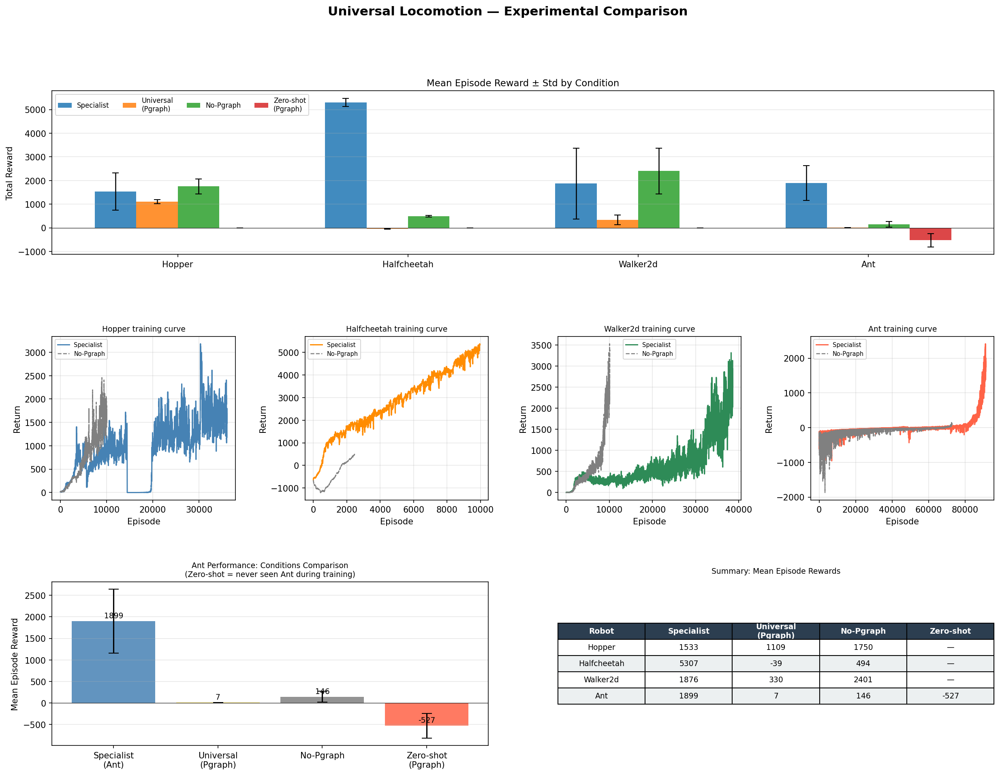

# Universal Locomotion & Arm Reach Planner

Morphology-aware universal policies across heterogeneous robot bodies using **pGraph encoding**, Transformer self-attention, and Physics-Informed Neural Networks.

Two task domains:
- **Locomotion** — Hopper, HalfCheetah, Walker2d, Ant (MuJoCo / Gymnasium)
- **Arm Reach** — Franka Panda, UR10, Kinova Gen3 (Isaac Lab / Isaac Sim)

---

## Isaac Lab — Universal Arm Reach Policy

> **Branch:** `feature/isaaclab-pgraph-arm`

### Method

A single pGraph Transformer policy controls Franka (7-DOF) and UR10 (6-DOF) for end-effector reach tasks. The key insight: pad all robots to `MAX_JOINTS=8` and encode each joint as a graph node with topology features `[depth, type, lim_lo, lim_hi, mask]`. The Transformer attends over joint + EE + goal tokens, masking padding slots.

**Universal action space:** policy always outputs `MAX_JOINTS=8` actions. A thin wrapper slices to each robot's actual DOF before stepping the environment.

**Curriculum training** (Isaac Lab only allows one SimulationContext per process, so robots train sequentially):
```
Step 1:  train --robot franka --iterations 1500              (sıfırdan)
Step 2:  train --robot ur10   --iterations 1500 --resume <franka_ckpt>
Step 3:  train --robot franka --iterations 1500 --resume <ur10_ckpt>
Step N:  alternating rounds until convergence
```

### Architecture

```
Observation (78-dim, same for all robots):
  [0:40]   pGraph features    — (MAX_JOINTS=8, 5)  [depth, type, lim_lo, lim_hi, mask]
  [40:48]  padded_joint_pos   — (8,)  zero-padded
  [48:56]  padded_joint_vel   — (8,)  zero-padded
  [56:63]  ee_pose            — (7,)  [pos(3) + quat_wxyz(4)]
  [63:70]  goal_pose          — (7,)
  [70:78]  padded_last_action — (8,)  zero-padded

Token construction (10 tokens × 8 dims → project to d_model=128):
  Joint tokens 0-7 : cat(pgraph[i]:5, pos[i]:1, vel[i]:1, act[i]:1)
  EE token      8  : cat(ee_pose:7, 0:1)
  Goal token    9  : cat(goal_pose:7, 0:1)

Transformer Encoder: 2 layers, 4 heads, pre-LN, padding mask on pgraph[i,4]==0
Actor head:   joint tokens[:num_actions] → Linear(d_model, 1) → action means
Critic head:  mean-pool valid tokens → MLP → V(s)
```

### Curriculum Training Results

| Round | Robot | Checkpoint | Pos Error (train) | Pos Error (demo, 50 ep) | Ori Error (demo) |
|---|---|---|---|---|---|
| R1 | Franka | `franka/2026-03-31_.../model_1499.pt` | 0.033 m | **0.033 m** | — |
| R2 | UR10 ← Franka R1 | `ur10/2026-04-01_.../model_1499.pt` | 0.340 m | 0.310 m | 30.9° |
| R3 | Franka ← UR10 R2 | `franka/2026-04-01_.../model_1499.pt` | 0.089 m | **0.098 m** | 19.3° |
| R4 | UR10 ← Franka R3 | `ur10/2026-04-02_.../model_1499.pt` | 0.221 m | **0.174 m** | 40.0° |

UR10 position error improves ~44% per curriculum round (0.340 → 0.174 m after R4). Franka remains stable across rounds (0.033 → 0.098 m at R3, recovering with more training).

### Usage

```bash
# Train single robot (sıfırdan)
conda run -n env_isaaclab python scripts/isaaclab_arm/train.py \
    --robot franka --num_envs 1024 --iterations 1500 --headless

# Fine-tune on another robot (curriculum)
conda run -n env_isaaclab python scripts/isaaclab_arm/train.py \
    --robot ur10 --num_envs 1024 --iterations 1500 --headless \
    --resume logs/pgraph_arm/franka/<run>/model_1499.pt

# Evaluate / headless demo
conda run -n env_isaaclab python scripts/isaaclab_arm/test.py \
    --robot ur10 --checkpoint logs/pgraph_arm/ur10/<run>/model_900.pt \
    --num_envs 4 --episodes 50 --headless

# Live Isaac Sim demo
conda run -n env_isaaclab python scripts/isaaclab_arm/test.py \
    --robot franka --checkpoint logs/pgraph_arm/franka/<run>/model_1499.pt \
    --num_envs 16 --episodes 200
```

### Key Files

```
scripts/isaaclab_arm/
├── policy.py          # PGraphTransformerActorCritic (d_model=128, 2L, 4H)
├── pgraph.py          # Per-robot topology features (Franka / UR10 / Kinova)
├── env_cfg.py         # UniversalArmReachEnvCfg — 78-dim fixed obs
├── train.py           # PPO training + --resume curriculum support
├── test.py            # Evaluation loop + metric parsing
├── multi_robot_env.py # MultiRobotVecEnv (designed for joint training;
│                      #   blocked by Isaac Lab single-SimulationContext
│                      #   constraint — use --resume instead)
├── agent_cfg.py       # UniversalArmPPORunnerCfg
└── configs/
    ├── franka_cfg.py  # 7-DOF, panda_hand EE
    ├── ur10_cfg.py    # 6-DOF, ee_link EE
    └── kinova_cfg.py  # 7-DOF, end_effector_link EE
```

---

## Project Structure

```
scripts/
├── isaaclab_arm/              # Isaac Lab — Universal Arm Reach (this branch)
│   ├── policy.py              # PGraphTransformerActorCritic
│   ├── train.py               # PPO + curriculum --resume
│   └── configs/               # Franka / UR10 / Kinova
│
├── universal_locomotion/      # V3 — Transformer pGraph policy (main)
│   ├── universal_env.py       # OBS_DIM=139, structured token obs layout
│   ├── ppo.py                 # UniversalActorCritic (Transformer, 25 tokens)
│   ├── train.py               # Multi-robot PPO training loop
│   ├── test.py                # Evaluation + result figures + MuJoCo demo
│   └── results/               # Training curves, eval figures
│
├── hjb_pgraph/                # V4 — pGraph + PINN/HJB (research branch)
│   ├── pinn_policy.py         # MorphHJBPolicy + HJBRolloutBuffer + HJBPPOTrainer
│   └── train_hjb.py           # Training with HJB physics loss
│
├── experiments/               # Controlled scientific comparison
│   ├── env_v2.py              # OBS_DIM=99 env (zero_pgraph ablation support)
│   ├── policy.py              # V2 MLP baseline policy
│   ├── run_all.py             # Run all 3 experiment types sequentially
│   ├── compare.py             # Load results + generate comparison figure
│   └── results/comparison.png # Final comparison figure
│
└── rodrinet/                  # Rodrigues rotation network baseline
    ├── rodrigues_network/     # Core network (operator, policy, envs)
    ├── train.py
    └── demo.py
```

---

## Observation Layout

### V3 (universal_locomotion) — OBS_DIM = 139

| Token group | Tokens | Features | Content |
|---|---|---|---|
| Morph tokens | 16 | 5 | pgraph_norm, jdof_norm, jtype_norm, body_mass_norm, body_mask |
| Joint tokens | 8 | 6 | joint_pos, joint_vel, dof_mask, lim_lo, lim_hi, gear_norm |
| Root token | 1 | 11 | lin_vel(3), ang_vel(3), height(1), quat(4) |

### V2 (experiments) — OBS_DIM = 99

| Block | Dim | Content |
|---|---|---|
| Morph (MORPH_DIM) | 64 | pgraph_norm[16], jdof_norm[16], jtype_norm[16], body_mask[16] |
| State (STATE_DIM) | 35 | joint_pos[8], joint_vel[8], dof_mask[8], root_state[11] |

---

## Architecture

### V3 — pGraph Transformer (UniversalActorCritic)

```
obs (139-dim)
  → parse: morph(B,16,5) + joint(B,8,6) + root(B,1,11)
  → Linear projections → d_model=256
  → Transformer Encoder (2 layers, 4 heads, pre-LN, padding mask)
  → Actor:  joint token outputs → per-joint [mean, log_std] → Gaussian
  → Critic: mean-pool over valid tokens → V(x)
```

### V4 — pGraph + PINN/HJB (MorphHJBPolicy)

Extends V3 with physics-informed losses:

**HJB Residual Loss**
```
r_hjb = V(x)·ln(γ) + R + ∇_x V(x)ᵀ · (x_{t+1} − x_t) / Δt
L_hjb = E[r_hjb²]
```

**Gradient Decomposition**
```
∇_x V splits into:
  ∇_morph V  (B, 80)  — sensitivity to robot topology
  ∇_joint V  (B, 48)  — sensitivity to joint kinematics
  ∇_root  V  (B, 11)  — sensitivity to root body state
```

**Morphology Gradient Consistency Loss**
```
L_mc = (1/|R|) Σ_r  Var_batch[∇_morph V | robot=r]
```
Enforces that the policy builds a stable structural representation per robot topology — improves zero-shot transfer.

**Total Loss**
```
L = L_ppo_actor + 0.25·L_bellman + λ_hjb·L_hjb + λ_mc·L_mc − ent·entropy
```

---

## Experimental Results

### Comparison: Specialist vs Universal vs No-Pgraph vs Zero-shot

All trained with 10M steps (V2 MLP policy, OBS_DIM=99).

| Robot | Specialist | Universal (Pgraph v3) | No-Pgraph | Zero-shot |
|---|---|---|---|---|
| Hopper | **1533** | 1109 | 1750 | — |
| HalfCheetah | **5307** | -39 | 494 | — |
| Walker2d | **1876** | 330 | **2401** | — |
| Ant | **1899** | 7 | 146 | -527 |



**Key findings:**
- Specialist policies outperform universal ones at 10M steps — expected given single-robot focus
- Universal (Pgraph v3) underperforms at 10M steps — Transformer requires 30M+ steps to converge
- No-Pgraph Walker2d outperforms Specialist — MLP exploits Walker2d's simpler dynamics without structural bias
- Zero-shot Ant transfer fails entirely — morphology generalisation remains an open problem

### V3 Universal Policy (30M steps, Transformer)

| Robot | Mean Reward |
|---|---|
| Hopper | 1109 |
| HalfCheetah | -39 |
| Walker2d | 330 |
| Ant | 7 |

Training logs and figures: `scripts/universal_locomotion/results/`

### V4 HJB-pGraph Policy (20M steps, λ_hjb=0.05)

| Robot | Mean Reward | Notes |
|---|---|---|
| Hopper | 32 | Early stage |
| HalfCheetah | -158 | HJB loss dominance |
| Walker2d | 225 | Improving |
| Ant | 21 | Stable |

HJB physics loss converging (L_hjb → 33.4, L_mc → 1.93). Requires longer training and λ_hjb tuning.

---

## Usage

### Train universal policy (V3 Transformer)
```bash
python scripts/universal_locomotion/train.py --steps 30000000 --envs 4
python scripts/universal_locomotion/train.py --resume          # continue from checkpoint
python scripts/universal_locomotion/train.py --compile         # ~20% faster with torch.compile
```

### Evaluate + demo
```bash
python scripts/universal_locomotion/test.py                    # all robots + plots
python scripts/universal_locomotion/test.py --render ant --speed 0.3
```

### Train HJB-pGraph policy (V4)
```bash
python scripts/hjb_pgraph/train_hjb.py --steps 50000000 --lambda_hjb 0.01
python scripts/hjb_pgraph/train_hjb.py --resume
```

### Run scientific comparison experiments
```bash
python scripts/experiments/run_all.py --steps 10000000
python scripts/experiments/compare.py
```

### RodriNet baseline
```bash
cd scripts/rodrinet
python train.py
python demo.py
```

---

## References

| Paper | Relevance |
|---|---|
| Musa Nurullah Yazar et al. (2018) — *Path Defined Directed Graph Vector (pGraph)* | Morphology encoding backbone |
| Bohlinger et al. (2025) — *One Policy to Run Them All* | Multi-embodiment locomotion benchmark |
| Huang et al. (2020) — *One Policy to Control Them All* | Shared modular policies baseline |
| Luo et al. (2025) — *GCNT: Graph-Based Transformer Policies* | Graph + Transformer architecture |
| Mukherjee & Liu (2023) — *Bridging PINNs with RL: HJB-PPO* | Physics-informed HJB loss (V4) |
| Shin et al. (2026) — *Articulated-Body Dynamics Network* | Dynamics-informed message passing |
| Zhang et al. (2025) — *Morphology-Aware Graph RL* | Tensegrity robot locomotion |

---

## TODO

### Immediate fixes
- [ ] Fix episode reward logging bug in `train_hjb.py` (`if r in log` → `if f'ep_rew_{r}' in log`)
- [ ] Add per-robot reward normalisation to HJB trainer

### Training
- [ ] Train V3 Transformer policy for 100M+ steps
- [ ] Train V4 HJB-pGraph for 50M steps with `λ_hjb=0.01`
- [ ] Hyperparameter sweep: λ_hjb ∈ {0.001, 0.01, 0.05, 0.1}

### Architecture
- [ ] Integrate ABD-Net style bottom-up message passing into pGraph tokens before Transformer
- [ ] Replace finite-difference dynamics with learned morphology-conditioned model `f_θ(x, u; morph)`
- [ ] Positional encoding for pGraph tree depth (parent-child hierarchy)
- [ ] Multi-scale Transformer: local (per-limb) + global (whole-body) attention layers

### Experiments
- [ ] Rerun comparison with 30M steps to fairly compare V2 MLP vs V3 Transformer
- [ ] Zero-shot: train on Ant+Walker2d+Hopper → test on HalfCheetah
- [ ] Morphology interpolation: evaluate on robots with intermediate body proportions
- [ ] Ablation: HJB-only vs MC-only vs combined loss
- [ ] Visualise `∇_morph V` norms per robot — which body links matter most for value

### Infrastructure
- [ ] Unified checkpoint format across V2/V3/V4 policies
- [ ] TensorBoard logging for all training runs
- [ ] Docker container for reproducible training environment
