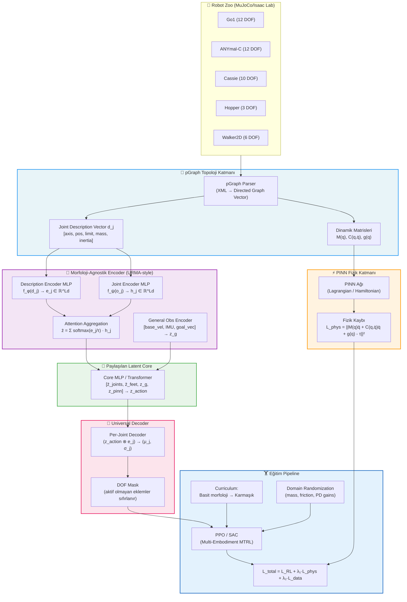

# pGraph-PINN-RL Unified Policy: Proje Mimarisi

## Genel Bağlam ve Hedef

**Amaç:** Farklı kinematik yapıdaki robotlar (Go1, ANYmal-C, Cassie, Hopper vb.) için **tek bir ortak lokomotion politikası** öğrenmek.  
Üç temel bileşen birleştirilecek:
1. **pGraph** → Robot topolojisini yönlü graf vektörü olarak kodlar (Newton-Euler + SOA tabanlı)
2. **PINN** → Gömülü fizik kısıtlamaları (Euler-Lagrange / Newton-Euler denklemleri) ile tutarlı dinamik öğrenimi
3. **PPO (RL)** → Ortak politika eğitimi, hedef-koşullu (goal-conditioned) görev çözümü

---

## Makale Analizi ve Arşitektonik Öğrenimler

### 1. Bohlinger et al. 2025 — "One Policy to Run Them All" (URMA)
> **Temel katkı:** URMA mimarisi — **morfoloji-agnostik encoder + universal decoder**

- **Joint Description Vector `d_j`:** Her ekleme özgü sabit-boyutlu tanımlayıcı (dönme ekseni, göreceli pozisyon, tork/hız limiti, kontrol aralığı).  
  _pGraph ile bağlantısı_: pGraph zaten bu bilgileri yön-vektörü formatında encode eder → `d_j` pGraph traversal vektöründen türetilecek.
- **Attention Encoder:** `z_j = softmax(f_φ(d_j) / (τ+ε)) · f_ψ(o_j)` — Sıfır-padding olmadan değişken sayıda eklemi handle eder.
- **Universal Decoder:** Her eklem için `(z_latent, d_j)` çiftinden `(μ_j, σ_j)` üretir.
- **Önemli bulgu:** GNN message-passing'i bottleneck yaratıyor; global attention tercih edilmeli.

### 2. MetaLoco (ETH, 2407.17502) — Meta-RL + Motion Imitation
> **Temel katkı:** LSTM hafıza birimi + RL ile az sayıda robotla evrensel politika

- Az sayıda robot (prosedürel quadruped), meta-RL ile zero-shot transfer
- **Hafıza birimi kritik** → adaptasyon hızını belirliyor
- Referans hareket imitasyonu (reference motion imitation) reward tasarımını basitleştiriyor

### 3. ABD-NET (Shin et al. 2026, arXiv:2603.19078) — Dinamik Prior
> **Temel katkı:** Articulated Body Algorithm'ı GNN içine gömme

- Inertia propagation: child→parent (ağaç yapısı boyunca)
- Fiziksel miktar yerine **öğrenilir parametre** → pGraph M(q), h(q,q̇) matrisleriyle birleştirilecek
- **pGraph ile sinerji:** pGraph zaten Newton-Euler SOA tabanlı → ABD-NET'in inertia propagation sırası pGraph traversal sırasıyla doğrudan eşleşir

### 4. Rytz et al. 2025 (Oxford, 2510.07094) — Universal Quadruped Sampling
> **Temel katkı:** PD gain randomization + konfigürasyon sampling stratejileri

- Sadece quadruped morfoloji sınıfında, ama sim-to-real için önemli
- **Bulgu:** PD gain randomizasyonu sim-to-real boşluğunu kapatmada kritik

### 5. Rodrigues Network (2506.02618) — Kinematic Prior
> **Temel katkı:** Forward kinematics operasyonunun öğrenilebilir genelleştirilmesi

- `Neural Rodrigues Operator`: `f(θ) = cos(θ)·W₁ + sin(θ)·W₂ + W₃` formundaki kinematik bias
- pGraph'ın yön vektörlerine (dönme eksenleri) doğrudan entegre edilebilir

### 6. Yazar & Yesiloglu 2018 — pGraph Metodu
> **Temel katkı:** Yol-tanımlı yönlü graf vektörü, topoloji değişimini O(n) ile handle eder

- **Pgraph vektörü:** Her gövde için kök-gövdeye giden tüm yolu kodlayan vektör
- **SOA + Newton-Euler:** Kütlece-eylemsizlik matrisi M(q), Coriolis h(q,q̇) hesabı
- Kapı kinetiği (temas geçişleri) etkin topoloji güncellemeyi destekliyor

---

## Önerilen Proje Mimarisi: **pGraph-URMA-PINN**



---

## Modüler Proje Yapısı

```
UnifiedPolicy/
│
├── configs/
│   ├── robots/
│   │   ├── go1.yaml           # pGraph + kinematik parametreler
│   │   ├── anymal_c.yaml
│   │   ├── cassie.yaml
│   │   ├── hopper.yaml
│   │   └── walker2d.yaml
│   ├── train_config.yaml      # PPO hiper-parametreleri, PINN λ katsayıları
│   └── curriculum.yaml        # Aşamalı eğitim planı
│
├── src/
│   ├── topology/
│   │   ├── pgraph_parser.py   # XML/URDF → pGraph vektörü
│   │   ├── pgraph_dynamics.py # M(q), C(q,q̇), g(q) hesabı (SOA tabanlı)
│   │   └── joint_descriptor.py# Joint Description Vector d_j üretimi
│   │
│   ├── network/
│   │   ├── joint_encoder.py   # f_ψ: o_j → h_j  (per-joint MLP)
│   │   ├── desc_encoder.py    # f_φ: d_j → e_j  (per-joint MLP)
│   │   ├── attention_agg.py   # Attention aggregation with learnable τ
│   │   ├── pinn_layer.py      # PINN: Lagrangian / Hamiltonian residual
│   │   ├── core_network.py    # Shared latent MLP/Transformer
│   │   ├── universal_decoder.py# Per-joint (μ,σ) üretici
│   │   └── unified_policy.py  # Tüm bileşenleri birleştiren ana politika
│   │
│   ├── env/
│   │   ├── robot_registry.py  # Robot havuzu yönetimi
│   │   ├── multi_morph_env.py # MuJoCo multi-robot ortamı (MTRL)
│   │   ├── observation.py     # Gözlem standardizasyonu
│   │   ├── reward.py          # Hedef-koşullu ödül fonksiyonları
│   │   └── curriculum.py      # Aşamalı zorluk artışı
│   │
│   ├── training/
│   │   ├── ppo_trainer.py     # PPO + PINN loss entegrasyonu
│   │   ├── loss_functions.py  # L_RL, L_phys, L_data
│   │   └── domain_rand.py     # Kütle, sürtünme, PD gain randomizasyonu
│   │
│   └── evaluation/
│       ├── evaluator.py       # Çok-robot eval pipeline
│       └── visualizer.py      # MuJoCo viewer + metrik görselleştirme
│
├── scripts/
│   ├── train.py               # Ana eğitim script'i
│   ├── eval.py                # Değerlendirme script'i
│   └── export_policy.py       # ONNX/TorchScript export
│
├── assets/
│   ├── robots/                # MuJoCo XML dosyaları
│   └── terrains/              # Çeşitli zemin konfigürasyonları
│
└── tests/
    ├── test_pgraph.py
    ├── test_pinn.py
    └── test_env.py
```

---

## Bileşen Tasarım Detayları

### Katman 1: pGraph Topoloji Modülü

**Girdi:** Robot URDF/MuJoCo XML  
**Çıktı:** Her eklem için `d_j ∈ ℝ^D_desc` Joint Description Vector

```
d_j = [
    axis_x, axis_y, axis_z,        # dönme/öteleme ekseni (3)
    pos_in_parent_x, y, z,          # gövde koordinat çerçevesi (3)
    q_lower, q_upper,               # eklem limitleri (2)
    qd_limit, tau_limit,            # hız ve tork limitleri (2)
    link_mass,                      # bağlı gövde kütlesi (1)
    link_inertia_xx, yy, zz,        # diagonal eylemsizlik (3)
    pgraph_depth,                   # kökten derinlik (1)
    pgraph_path_hash                # topoloji parmak izi (1 → embedding)
]  # Toplam: ~16-20 boyut
```

**pGraph'ın URMA'ya üstünlüğü:**
- Statik `d_j` yerine, pGraph **topoloji değişimini** (örn. ayak teması) dinamik olarak encode eder
- Newton-Euler SOA tabanlı M(q), C(q,q̇) matrisleri **PINN kaybı için** doğrudan kullanılabilir

---

### Katman 2: Morfoloji-Agnostik Encoder

**Girdi:** `{(o_j, d_j)}_{j∈J}` + `o_g` (genel gözlem)  
**Çıktı:** `z_latent ∈ ℝ^L` (sabit boyutlu, morfoloji-bağımsız latent)

```python
# Per-joint encoding
h_j = f_ψ(o_j)      # joint obs MLP → ℝ^Ld
e_j = f_φ(d_j)      # desc MLP → ℝ^Ld

# Attention aggregation (URMA eq. 2)
α_j = softmax(e_j / (τ + ε))
z_j = α_j * h_j
z̄_joints = Σ_j z_j  # ℝ^Ld

# General obs
z_g = f_g(o_g)      # ℝ^Lg (sabit boyut)

# Concat → core
z_input = concat([z̄_joints, z̄_feet, z_g])  # ℝ^(Ld+Ld+Lg)
```

---

### Katman 3: PINN Fizik Katmanı

**Amaç:** Newton-Euler denklemlerini politikanın öğrenme sinyaline gömmek

```
L_phys = ||M(q)·q̈ + C(q,q̇)·q̇ + g(q) - τ_pred||²

M(q)  : pGraph SOA ile hesaplanan kütle-eylemsizlik matrisi
C(q,q̇): Coriolis + merkezkaç terimi  
g(q)  : yerçekimi terimi
τ_pred: politikanın ürettiği tork tahmini
```

**İki PINN modu:**
1. **Soft Constraint (λ-ağırlıklı):** `L_total = L_RL + λ_phys · L_phys`
2. **Hard Constraint (projeksiyon):** Politika çıkışını fizik manifolduna projekte et

**Önerilen başlangıç:** Soft constraint (λ_phys=0.1), eğitim ilerledikçe artır.

---

### Katman 4: Universal Decoder

**Girdi:** `z_action` (core'dan) + `e_j` (her eklem tanımlayıcısı)  
**Çıktı:** Her aktüe eklem için `(μ_j, σ_j)`

```python
for j in active_joints:
    input_j = concat([z_action, e_j])
    μ_j, σ_j = decoder_mlp(input_j)
    
# Inactive joints (padding morfolojiler için)
μ_j = 0, σ_j = 0  for j not in active_joints
```

---

### Katman 5: PPO Eğitim Pipeline

**Multi-Task RL Objeksiyonu (URMA eq. 1):**
```
J(θ) = (1/M) Σ_m J^m(θ)
J^m(θ) = E[Σ_t γ^t r^m(s,a)]
```

**Toplam Kayıp:**
```
L_total = L_PPO + λ₁·L_phys + λ₂·L_consistency
```
- `L_phys`: Newton-Euler residual (PINN)
- `L_consistency`: Aynı morfoloji için tutarlı eylem dağılımı

**Curriculum Stratejisi:**
1. **Aşama 1:** Hopper + Walker2D (düşük DOF, 2D hareket)
2. **Aşama 2:** Go1 + ANYmal-C (4-bacaklı, 3D)
3. **Aşama 3:** Cassie (bipedaloid, zor)
4. **Aşama 4:** Tüm robots birlikte

---

## Observation Space Tasarımı

```
o_g (Genel Obs, sabit 25 boyut):
  - base_lin_vel [3]        ← IMU
  - base_ang_vel [3]        ← IMU  
  - gravity_projection [3]  ← R^T · g
  - goal_vector [2]         ← goal_xy - current_xy (body frame)
  - last_action [max_nu]    ← pad edilmiş (veya aggregate)
  
o_j (Per-Joint Obs, değişken):
  - q_j  [1]  ← eklem pozisyonu
  - q̇_j [1]  ← eklem hızı
  - contact_j [1] (ayak eklemleri için)

d_j (Per-Joint Description, sabit ~18 boyut):
  - pGraph'tan türetilen tanımlayıcı (yukarıda detaylı)
```

---

## Ödül Fonksiyonu

```python
r_total = (
    w_goal  * r_goal_progress   # hedefe yaklaşma
  + w_vel   * r_cmd_vel         # komut hız takibi
  + w_alive * r_alive           # ayakta kalma
  - w_energy* p_energy          # enerji tüketimi
  - w_action* p_action_smooth   # eylem pürüzsüzlüğü
  - w_orient* p_orientation     # eğim cezası
)
```

**Robot-spesifik parametreler (config.yaml'dan):**
- `target_height`, `alive_threshold`, `energy_scale`

---

## Teknoloji Yığını

| Bileşen | Teknoloji |
|---------|-----------|
| Simülasyon | MuJoCo 3.x / Isaac Lab (paralel) |
| RL Framework | Stable-Baselines3 / Custom PPO |
| DL Framework | PyTorch 2.x |
| pGraph | Mevcut Python implementasyonu |
| PINN | PyTorch autograd tabanlı |
| Loglama | TensorBoard + Weights & Biases |
| Export | ONNX (gerçek robot deploy) |

---

## URMA vs pGraph-URMA: Temel Fark

| | URMA (Bohlinger 2025) | **pGraph-URMA (Bu Proje)** |
|--|--|--|
| Joint Description | Statik, elle tasarlanmış | **pGraph'tan otomatik türetilmiş** |
| Fizik Kısıtı | Yok | **PINN (Newton-Euler residual)** |
| Topoloji Değişimi | Desteklemiyor | **pGraph dinamik topoloji** |
| Dinamik Prior | Yok | **ABD-NET tarzı inertia propagation** |
| Transfer | Zero/few-shot | Zero/few-shot + **fizik tutarlılığı** |

---

## Açık Sorular

> [!IMPORTANT]
> **Soru 1:** pGraph parser mevcut kodda var mı, yoksa sıfırdan mı yazılacak?  
> Cevaba göre `topology/pgraph_parser.py` tasarımı değişecek.

> [!IMPORTANT]
> **Soru 2:** Hangi simülatör tercih edilecek — MuJoCo (tek işlem) mi, Isaac Lab (massively parallel GPU) mi?  
> Isaac Lab tercih edilirse mimari önemli ölçüde değişecek (vectorized envs).

> [!WARNING]
> **Soru 3:** PINN'in eğitim yükü: M(q) hesabı her adımda yapılırsa yavaşlayabilir.  
> Öneri: İlk N adım sadece RL, sonra PINN kaybını aşamalı ekle (λ warmup).

> [!NOTE]
> **Soru 4:** Cassie ve Walker2D'nin floating-base'i farklı yapıda.  
> Bunları ilk fazda dahil etmek zorunda değiliz; Go1 + ANYmal-C + Hopper başlangıç seti olarak yeterli.

---

## Doğrulama Planı

### Kısa Vadeli (Haftalar 1-2)
```bash
# 1. pGraph parser testi
python tests/test_pgraph.py --robot go1

# 2. Env smoke test
python -c "from src.env.multi_morph_env import MultiMorphEnv; e = MultiMorphEnv(); e.reset(); print('OK')"

# 3. PINN loss sanity check
python tests/test_pinn.py --verify-newton-euler
```

### Orta Vadeli (Haftalar 3-6)
- Go1 + Hopper ortak politika → her ikisi de yürüyebilmeli
- PINN kaybının Newton-Euler residual'ı azalttığını TensorBoard'da gözlemleme
- ANYmal-C ekleme (zero-shot ilk deneme)

### Uzun Vadeli
- 5+ morfoloji birlikte eğitim
- Sim-to-real: Go1 veya ANYmal-C üzerinde doğrulama
- Unseen morfoloji zero-shot transfer testi
